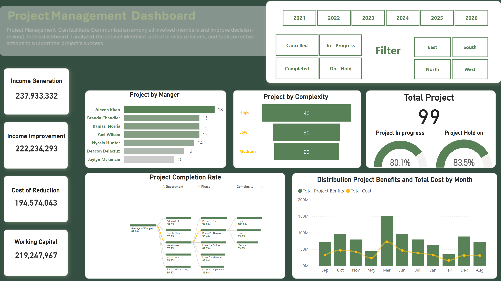
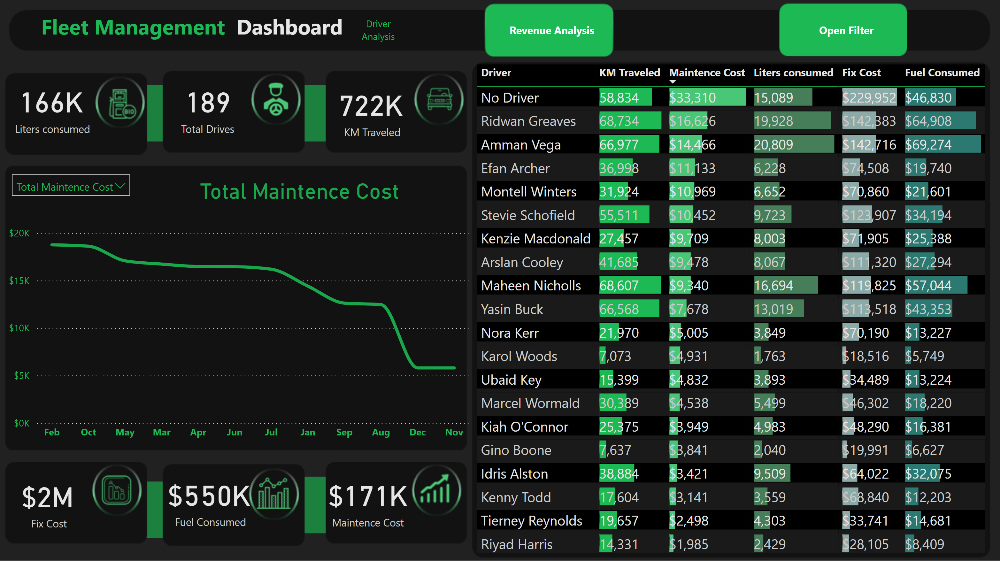
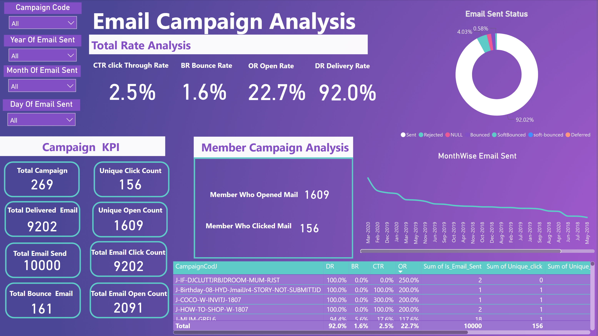

# PowerBI-Projects

### [🌟 Project Management Dashboard – Driving Success through Insights 🌟](https://www.linkedin.com/posts/hegazy-ahmed_projectmanagement-dataanalytics-dashboarddesign-activity-7283580562982756352-FDs8?utm_source=share&utm_medium=member_desktop)

[Project Link](https://www.linkedin.com/posts/hegazy-ahmed_projectmanagement-dataanalytics-dashboarddesign-activity-7283580562982756352-FDs8?utm_source=share&utm_medium=member_desktop)

This project management dashboard provides insights into the performance and progress of various projects. It is designed to facilitate communication, enhance decision-making, and track key performance metrics effectively.  

### Key Insights  
- 💼 **Income Generation**: Projects have generated a total of **$237.93 million**, showcasing their impact on driving revenue.  
- 📈 **Process Improvement**: Delivered an income improvement of **$222.23 million**, reflecting the efficiency of optimization initiatives.  
- 💰 **Working Capital Enhancement**: Achieved a working capital improvement of **$219.25 million**, strengthening financial resilience.  
- 💡 **Cost Reduction**: Realized total savings of **$411.51 million**, highlighting effective resource utilization.  

### Project Complexity  
- **High Complexity**: 40 projects  
- **Medium Complexity**: 29 projects  
- **Low Complexity**: 30 projects  

### Performance Highlights  
- ✅ **Average Completion Rate**: **87%**, demonstrating strong progress and timely execution.  
- 📊 **Project Status**:  
  - **In Progress**: 25.3%  
  - **On Hold**: 17.2%  

### Tools & Technologies  
- **Tools Used**: Tableau, Excel  
- **Technologies**: Data visualization, project management analytics  

### About the Dashboard  
This dashboard was created to analyze a dataset of project management performance. It identifies potential risks, highlights project complexities, and tracks progress to ensure the success of each initiative.  

Feel free to connect if you'd like to know more about this project or discuss how dashboards can transform your decision-making process!  

---

### [Fleet Management Dashboard](https://www.linkedin.com/posts/hegazy-ahmed_hello-everyone-i-have-created-fleet-management-activity-7138771849252958210-OGlD?utm_source=share&utm_medium=member_desktop) | [Link](https://www.linkedin.com/posts/hegazy-ahmed_hello-everyone-i-have-created-fleet-management-activity-7138771849252958210-OGlD?utm_source=share&utm_medium=member_desktop)

To improve customer retention, focus on several key strategies. Implement loyalty programs and personalized communication to encourage repeat purchases. 

Leverage purchase patterns for upselling and cross-selling opportunities, increasing average order value. Engage with customers regularly through email campaigns, newsletters, or social media to keep them informed about new products and promotions. 

Encourage customers to leave feedback and reviews, which can attract new customers and boost loyalty. Segment customers based on their purchase history for targeted marketing campaigns with personalized promotions. 

Analyze the customer journey to identify and improve any pain points. Provide excellent customer support to promptly address any issues or concerns.

Implement referral programs, offering incentives for successful referrals to expand the customer base. Conduct competitor analysis to understand why customers choose your business over others and enhance your offerings accordingly. 

By focusing on these strategies, the business can build a loyal customer base and achieve long-term growth and success.

---

### [Analyzing email marketing performance](https://www.linkedin.com/posts/hegazy-ahmed_marketing-mail-mailcamapign-activity-7184779199214219265-rVsn?utm_source=share&utm_medium=member_desktop) | [Link](https://www.linkedin.com/posts/hegazy-ahmed_marketing-mail-mailcamapign-activity-7184779199214219265-rVsn?utm_source=share&utm_medium=member_desktop)

**KPIs**

- Open Rate: This metric measures the percentage of recipients who opened your email.
- Click-Through Rate (CTR): CTR measures the percentage of recipients who clicked on a link or call-to-action within your email.
- Bounce Rate: Bounce rate indicates the percentage of emails that were not successfully delivered to recipients' inboxes.
- Time and Day of Sending: Analyzing the performance of your emails based on the time and day they were sent can help identify the optimal send times for your audience.

